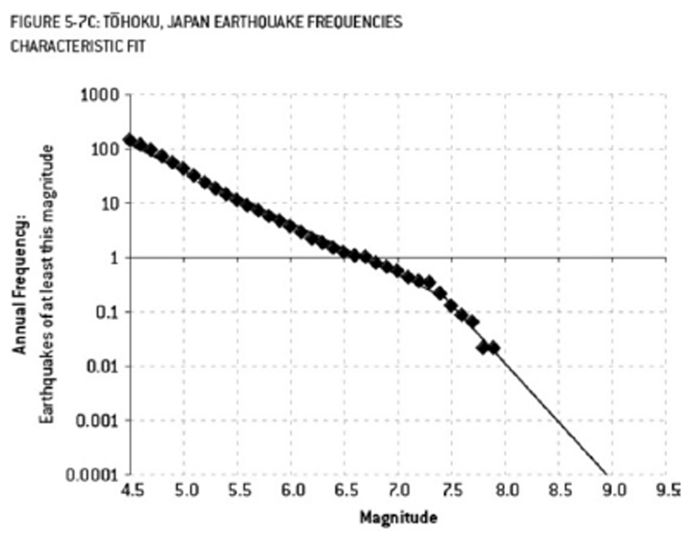
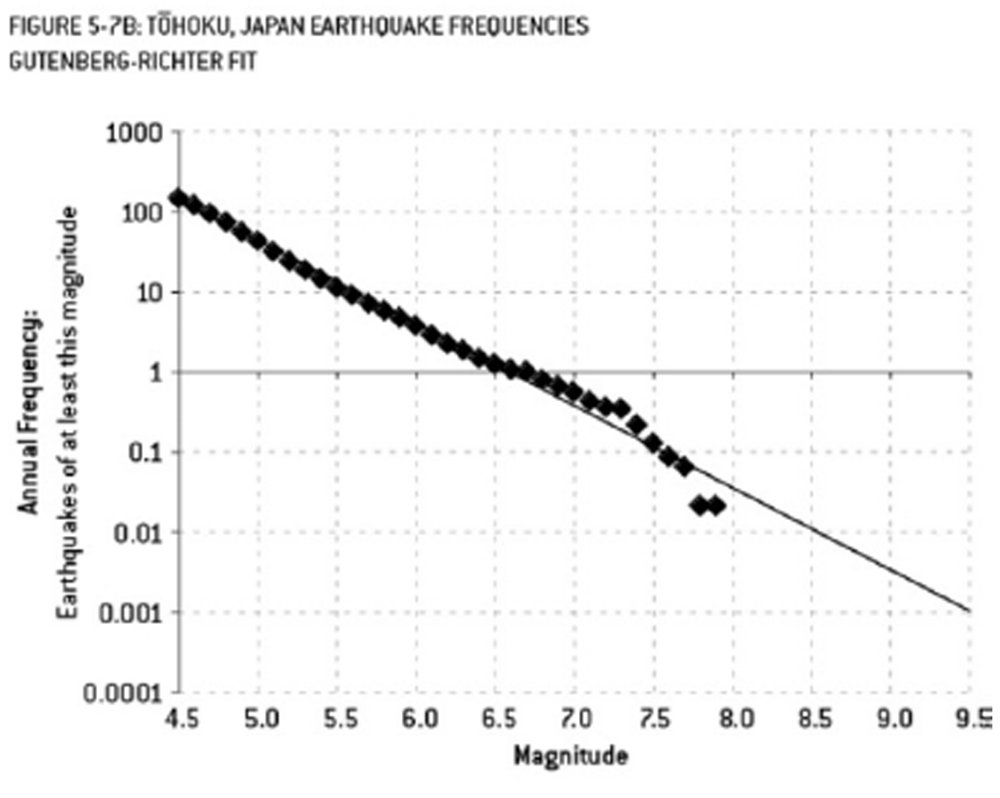

```{julia}
#| output: false

import Pkg
Pkg.activate(@__DIR__)
Pkg.instantiate()
```

```{julia}
#| output: false

using Random
using DataFrames
using DataFramesMeta
using CSV
using Dates
using Distributions
using ColorSchemes
using Plots
using StatsPlots
using StatsBase
using Optim
using LaTeXStrings
using Measures

Random.seed!(1)
ENV["GKSwstype"] = "nul"

plot_font = "Computer Modern"
default(
    fontfamily=plot_font,
    linewidth=3, 
    framestyle=:box, 
    label=nothing, 
    grid=false,
    guidefontsize=18,
    legendfontsize=16,
    tickfontsize=16,
    titlefontsize=20,
    bottom_margin=10mm,
    left_margin=5mm
)
```

# Last Class

## Model Scoring

- Rely on metrics of predictive skill
- Different metrics (MSE, MAE, likelihood) reflect different **loss functions**.
- Use in-sample scores as heuristics.
- Proper scoring rules for probabilistic forecasts.

# Bias and Variance

## Impact of Increasing Model Complexity

```{julia}
#| label: fig-true-data
#| fig-cap: True data and the data-generating curve.
#| echo: true
#| code-fold: true
#| warning: false
#| error: false

ntrain = 20
x = rand(Uniform(-2, 2), ntrain)
f(x) = x.^3 .- 5x.^2 .+ 1
y = f(x) + rand(Normal(0, 2), length(x))
p0 = scatter(x, y, label="Data", markersize=5)
xrange = -2:0.01:2
plot!(p0, xrange, f.(xrange), lw=3, color=:gray, label="True Curve")
plot!(p0, size=(1000, 450))
```

## Impact of Increasing Model Complexity

```{julia}
#| label: fig-true-data-1
#| fig-cap: Impact of increasing model complexity on model fits
#| echo: true
#| code-fold: true
#| layout-ncol: 2
#| warning: false
#| error: false

function polyfit(d, x, y)
    function m(d, θ, x)
        mout = zeros(length(x), d + 1)
        for j in eachindex(x)
            for i = 0:d
                mout[j, i + 1] = θ[i + 1] * x[j]^i
            end
        end
        return sum(mout; dims=2)
    end
    θ₀ = [zeros(d+1); 1.0]
    lb = [-10.0 .+ zeros(d+1); 0.01]
    ub = [10.0 .+ zeros(d+1); 20.0]
    optim_out = optimize(θ -> -sum(logpdf.(Normal.(m(d, θ[1:end-1], x), θ[end]), y)), lb, ub, θ₀)
    θmin = optim_out.minimizer
    mfit(x) = sum([θmin[i + 1] * x^i for i in 0:d])
    return (mfit, θmin[end])
end

function plot_polyfit(d, x, y)
    m, σ = polyfit(d, x, y)
    p = scatter(x, y, label="Data", markersize=5, ylabel=L"$y$", xlabel=L"$x$", title="Degree $d")
    plot!(p, xrange, m.(xrange), ribbon = 1.96 * σ, fillalpha=0.2, lw=3, label="Fit")
    ylims!(p, (-30, 15))
    plot!(p, size=(600, 450))
    return p
end

p1 = plot_polyfit(1, x, y)
p2 = plot_polyfit(2, x, y)

display(p1)
display(p2)
```

## Impact of Increasing Model Complexity

```{julia}
#| label: fig-true-data-2
#| fig-cap: Impact of increasing model complexity on model fits
#| echo: true
#| code-fold: true
#| layout-ncol: 2
#| warning: false
#| error: false

p3 = plot_polyfit(3, x, y)
p4 = plot_polyfit(4, x, y)

display(p3)
display(p4)
```

## Impact of Increasing Model Complexity

```{julia}
#| label: fig-true-data-3
#| fig-cap: Impact of increasing model complexity on model fits
#| echo: true
#| code-fold: true
#| layout-ncol: 2
#| warning: false
#| error: false

p5 = plot_polyfit(6, x, y)
p6 = plot_polyfit(10, x, y)

display(p5)
display(p6)
```

## What Is Happening?

We can think of a model as a form of **data compression**.

Instead of storing coordinates of individual points, project onto parameters of functional form.

The degree to which we can "tune" the model by adjusting parameters are called the **model degrees of freedom** (DOF), which is one measure of model complexity.

## Implications of Model DOF

Higher DOF &Rightarrow; more ability to represent complex patterns.

::: {.fragment .fade-in}
:::: {.columns}
::: {.column width=50%}
If DOF is too low, the model can't capture meaningful data-generating signals (**underfitting**).
:::
::: {.column width=50%}

```{julia}
#| label: fig-true-data-underfit
#| fig-cap: Impact of increasing model complexity on model fits
#| echo: false
#| warning: false
#| error: false

p1
```
:::
::::
:::

## Implications of Model DOF

Higher DOF &Rightarrow; more ability to represent complex patterns.

:::: {.columns}
::: {.column width=50%}
But if DOF is too high, the model will "learn" the noise rather than the signal, resulting in poor generalization (**overfitting**).
:::

::: {.column width=50%}
```{julia}
#| label: fig-true-data-overfit
#| fig-cap: Impact of increasing model complexity on model fits
#| echo: false
#| warning: false
#| error: false

p6
```

:::
::::

## In- Vs. Out-Of-Sample Error

```{julia}
#| label: fig-sample-error
#| fig-cap: Impact of increasing model complexity on in and out of sample error
#| echo: true
#| code-fold: true
#| warning: false
#| error: false

ntest = 20
xtest = rand(Uniform(-2, 2), ntest)
ytest = f(xtest) + rand(Normal(0, 2), length(xtest))

in_error = zeros(11)
out_error = zeros(11)
#calculate sum of squared errors
for d = 0:10
    m, σ = polyfit(d, x, y)
    in_error[d+1] = sum((m.(x) .- y).^2)
    out_error[d+1] = sum((m.(xtest) .- ytest).^2)
end

plot(0:10, in_error / length(y), marker=(:circle, :blue, 8), line=(:blue, 3), label="In-Sample Error", xlabel="Polynomial Degree", ylabel="Mean Squared Error", legend=:topleft)
plot!(0:10, out_error / length(y), marker=(:circle, :red, 8), line=(:red, 3), label="Out-of-Sample Error")
plot!(yaxis=:log)
plot!(xticks=0:1:10)
```

## Why Is Overfitting A Problem?

Example from *The Signal and the Noise* by Nate Silver:

:::: {.columns}
::: {.column width=50%}
- Fukishima engineers used a nonlinear model which predicted a >9 M~W~ earthquake had a 13,000-year RP
- Nuclear plant was designed to withstand an 8.6 M~W~ earthquake.
:::
::: {.column width=50%}

:::
::::

## Why Is Overfitting a Problem

Example from *The Signal and the Noise* by Nate Silver:

:::: {.columns}
::: {.column width=50%}
- Theoretical linear relationship suggests that a >9 M~W~ earthquake has a RP of 300 years.
- Using this model would have designed the plant to survive the 2011 9.1 M~W~ earthquake.
:::
::: {.column width=50%}

:::
::::

# Bias-Variance Tradeoff

## Decomposition of MSE

Suppose we use $\hat{f}(x)$ to predict data from a "true" regression model $f(x)$:

$$
\begin{aligned}
(Y - \hat{f}(x))^2 &= (Y - f(x) + f(x) - \hat{f}(x))^2 \\
&= (Y - f(x))^2 + 2(Y - f(x))(f(x) - \hat{f}(x)) + (f(x) - \hat{f}(x))^2 \\
\text{MSE}(\hat{f}(x)) &= \mathbb{V}(\varepsilon) + \mathbb{E}\left[(f(x) - \hat{f}(x))^2\right] \\
&= \mathbb{V}(\varepsilon) + \text{Bias}(\hat{f})^2
\end{aligned}
$$

## Second Bias-Variance Decomposition

But $\hat{f}(x)$ is also a random model $\hat{M_n}(x)$ based on the data. 

$$
\begin{aligned}
\text{MSE}(\hat{M_n}(x)) &= \mathbb{E}\left[(Y - \hat{M_n}(X))^2 | X = x\right] \\
&= \mathbb{E}\left[\mathbb{E}\left[\left(Y - \hat{M_n}(X)\right)^2 | X = x, \hat{M_n} = \hat{f} \right] | X = x\right] \\
&= \mathbb{E}\left[\mathbb{V}\left[\varepsilon\right] + \left(f(x) - \hat{M_n}(x)\right)^2 | X = x\right] \\
&= \mathbb{V}\left[\varepsilon\right] + \mathbb{E}\left[\left(f(x) - \hat{M_n}(x)\right)^2 | X = x \right]
\end{aligned}
$$

## Second Bias-Variance Decomposition

$$\begin{aligned}
\text{MSE}(\hat{M_n}(x)) &= \text{Var}\left[\varepsilon\right] + \mathbb{E}\left[\left(f(x) - \hat{M_n}(x)\right)^2 | X = x\right] \\
&= \mathbb{V}\left[\varepsilon\right] + \\ & \qquad \mathbb{E}\left[\left(f(x) - \mathbb{E}\left[\hat{M_n}(x)\right] + \mathbb{E}\left[\hat{M_n}(x)\right] - \hat{M_n}(x)\right)^2\right] \\
&= \mathbb{V}\left[\varepsilon\right] + \left(f(x) - \mathbb{E}\left[\hat{M_n}(x)\right]\right)^2 + \mathbb{V}\left[\hat{M_n}(x)\right]
\end{aligned}$$

## Bias vs. Variance

Therefore MSE consists of:

- Irreducible/process error; this is the statistical fluctuations even if the model were correct
- Bias, or approximation error in the model;
- Variance in the estimate of the model;

## Bias

**Bias** is error from mismatches between the model predictions and the data ($\text{Bias}[\hat{f}] = \mathbb{E}[\hat{f}] - y$).

Bias comes from the **approximation error**.

High bias indicates under-fitting meaningful relationships between inputs and outputs:

- too few degrees of freedom ("too simple")
- neglected processes.

## Variance

**Variance** is error from over-sensitivity to small fluctuations in training inputs $D$ ($\text{Variance} = \text{Var}_D(\hat{f}(x; D)$).

Variance can come from over-fitting noise in the data:

- too many degrees of freedom ("too complex")
- poor identifiability


## "Bias-Variance Tradeoff"

This means that **past a certain point**, you can only reduce bias (increasing model complexity) at the cost of increasing variance.

This is the so-called "bias-variance tradeoff."

This does not have to be 1-1: sometimes adding bias can reduce total error if it reduces variance more than it adds approximation error.

## More General B-V Tradeoff

This decomposition is for MSE, but the **principle holds more generally**.

- Models which perform better "on average" over the training data (low bias) are more likely to overfit (high variance);
- Models which have less uncertainty for training data (low variance) are more likely to do worse "on average" (high bias).

## Common Story: Complexity and Bias-Variance

::: {.center}
{width=55%}

::: {.caption}
Source: [Wikipedia](https://en.wikipedia.org/wiki/Bias%E2%80%93variance_tradeoff)
:::
:::


## Is "Bias-Variance Tradeoff" Useful?

::: {.incremental}

- **Tautology**: total error is the sum of bias, variance, and irreducible error.
- **Bias and variance do not directly tell us anything about generalizability** (prediction error is not necessarily monotonic; see *e.g.*  @Belkin2019-xy, @Mei2019-hb).
:::

## Approaches to Reducing Variance

- **Dimensionality reduction/feature selection**: Use hypotheses and domain knowledge, PCA
- **Regularization**: e.g. LASSO or ridge regression, maximize likelihood subject to constraint like $$\sum_{j=1}^k \beta_k \leq t.$$
- Use ensembles of "smaller" models and average instead of fitting one huge model (*e.g.* random forests or bagging instead of big CARTs or ANNs)
- **Cross-validation**: Friday

# Key Points and Upcoming Schedule

## Key Points (Bias)

- Bias: Discrepancy between expected model output and observations. 
- Related to approximation error and underfitting.
- "Simpler" models tend to have higher bias.
- High bias suggests less sensitivity to specifics of dataset.

## Key Points (Variance)

- Variance: How much the model predictions vary around the mean. 
- Related to estimation error and overfitting.
- "More complex" models tend to have higher variance.
- High variance suggests high sensitivity to specifics of dataset.

## Key Points (Bias-Variance Tradeoff)

- Error can be decomposed into bias, variance, and irreducible error.
- "Tradeoff" reflects this decomposition (but it's not really a one-to-one tradeoff).
- Useful conceptual to think about the balance between not picking up on meaningful signals (underfitting / high bias) and modeling noise (overfitting / high variance).

## Upcoming Schedule

- **Friday**: Cross-Validation
- HW3 Due Friday (3/6)
- Quiz 2: Friday (3/13)

# References

## References

